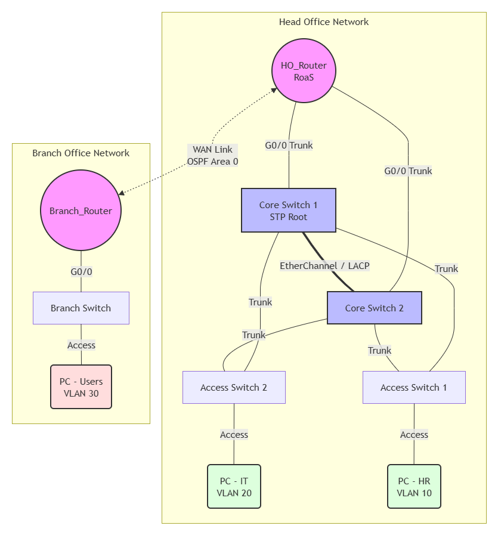

# Secure Enterprise Campus Network Design 🌐

## Project Overview
This project demonstrates the design and implementation of a secure, highly available Enterprise-grade Campus Network using Cisco Packet Tracer. The architecture consists of a Head Office and a Branch location, simulating a real-world corporate network infrastructure. The design focuses on implementing core networking protocols, strict security policies, and automated IP management to ensure a robust and scalable environment.

## 🏗️ Network Topology

## ⚙️ Key Technologies & Protocols Implemented

*   **Device Security:** Secured all critical network infrastructure (Routers & Switches) using encrypted Console, VTY, and Privileged Exec (Enable) passwords to prevent unauthorized administrative access.
*   **VLANs & Trunking:** Segmented the Head Office network into distinct departments (HR and IT) using VLANs (VLAN 10 & VLAN 20) to reduce broadcast domains and enhance logical security.
*   **Spanning Tree Protocol (STP):** Configured Root Bridges to prevent Layer 2 loops and ensure optimal traffic flow across redundant switch links.
*   **EtherChannel (LACP):** Bundled multiple physical links between Core Switches into a single logical link to optimize bandwidth and provide immediate link redundancy.
*   **Router-on-a-Stick:** Configured sub-interfaces (Gig0/0.10, Gig0/0.20) on the Head Office router with 802.1Q encapsulation to facilitate Inter-VLAN routing.
*   **DHCP Allocation:** Configured internal DHCP pools on Cisco routers for automated and error-free IP address assignment for all connected end devices across different subnets.
*   **OSPF (Open Shortest Path First):** Implemented Single-Area OSPF dynamic routing across the WAN link to ensure fast, efficient, and reliable packet delivery between the Head Office and Branch Office.
*   **Access Control Lists (ACLs):** Implemented security policies using Extended ACLs on the Head Office router to filter traffic. (e.g., Restricting the HR department from pinging the IT department while allowing access to the Branch network).

## 📁 Repository Contents
*   `Enterprise_Network_Design.pkt`: The complete Cisco Packet Tracer simulation file.
*   `Configs/`: A directory containing the exported configuration text files (`show running-config`) for the main Routers and Core Switches.
*   `topology.png`: A high-resolution screenshot of the network architecture.

## 🔐 Access Credentials
To access the CLI of the secured Routers and Core Switches in the Packet Tracer file, use the following lab credentials:
*   **Console / VTY Password:** `cisco`
*   **Privileged EXEC (Enable) Password:** `class`

## 🚀 How to Use
1. Clone this repository to your local machine.
2. Open the `Enterprise_Network_Design.pkt` file using **Cisco Packet Tracer**.
3. Allow a few seconds for the STP and OSPF processes to converge (links will turn green).
4. Test connectivity using the Command Prompt on the end devices (PCs).
   * Note: Pings from HR to IT are intentionally blocked via ACL. Pings from HR/IT to the Branch network will be successful.

## 👨‍💻 Author
**H.A.R. Madushika**
* IT Undergraduate | Actively seeking a Network Engineering Internship
* [LinkedIn Profile](https://www.linkedin.com/in/rashmi-madushika-76525a357/)
